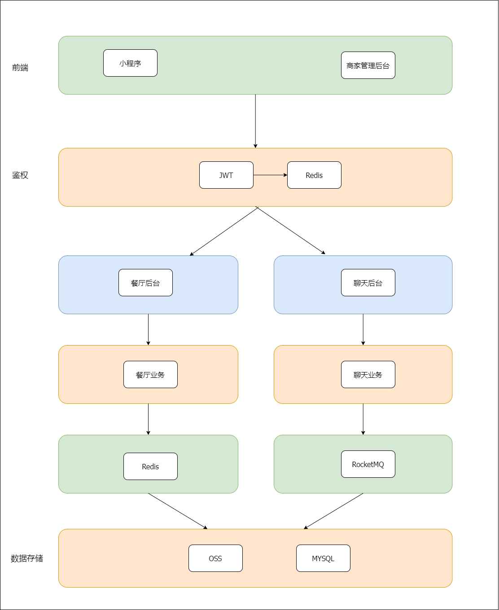

# cloud-canteen

# 介绍
基于SpringBoot、Mybatis、Redis、Vue开发的云餐厅平台

为商户提供餐厅管理、线上餐厅等功能；

为用户提供点餐功能，通过小程序浏览已上线的餐厅进行下单；

# 前端工程传送门
- 小程序 ：https://github.com/asoul-12/cloud-canteen-uniapp
- 后台 ：https://github.com/asoul-12/cloud-canteen-vue

# 在线体验

**后台** ：TODO

**小程序** ： 由于域名尚未备案，移动端暂未上线 

# 🕳技术选型：
## 1、系统环境
- Java 8
- Java EE 8
- Apache Maven 3.8.3
## 2、主框架
- Spring Boot 2.7.4
- Spring 5.3.23
## 3、持久层
- MyBatis-Plus 3.5.2
- Alibaba Druid 1.2.9
## 4、缓存层
- Redis 7.0.5
## 5、通讯中间件
- Netty 4.1.82
## 6、消息队列
- RocketMQ 5.0.0
## 6、视图层
- Vue 3.2.37
- TDesign 0.23.1
- axios 0.21.4
- Uni-app 3.6.4

# 系统架构



#  🎉 主要功能：
## 后台
- 商家入驻：使用者通过邮件激活的方式，注册成为商家
- 用户信息管理：用户信息的增删改查
- 菜品管理：菜品信息的增删改查
- 菜品分类管理：增删改查
- 员工管理：增删改查
- 订单管理：增删改查
- 客户交流：商家与用户的私聊

## 小程序
- 餐厅展示：展示所有入驻云餐厅平台的餐厅
- 用户下单：购物车结算并生成订单
- 用户订单：查看用户所有订单
- 商家交流：用户与商家的私聊
- 餐厅评价：TODO

# 项目结构
```
├── model                   // model层  
├── server                  
│   ├── canteen_server      // 餐厅后台服务器与业务
│   ├── chat_server         // 即时通讯服务器
├── service
│   ├── chat_service        // 聊天业务
│   └── 
   
```
# 快速开始

- 修改数据源
- 修改端口
- 配置redis
- 配置RocketMQ
- 配置邮箱密钥
- 配置小程序id与密钥
- 运行餐厅后台服务器
- 运行通讯服务器
- 运行聊天后台服务器
